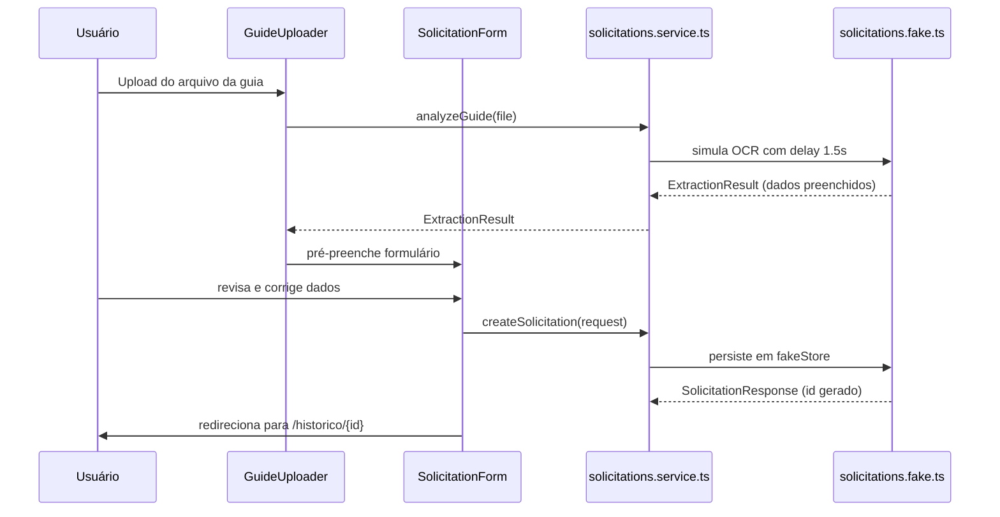

# Plano — Módulo de Execução de Guia

## Modo de Operação: Prototipação

**Motivo:** solicitação explícita do time de produto para validar o fluxo de UX antes da integração com o backend em produção. Os endpoints existem no Swagger e serão integrados após aprovação do protótipo. A Fake Service Layer garante que a substituição seja trivial — apenas uma flag de ambiente.

> Os contratos de request são derivados diretamente do Swagger. Os contratos de response (não documentados) são projetados com base nos campos do request e nas convenções de domínio observadas na API.

---

## Endpoints Mapeados (Swagger)

Verificados em `https://authz-api.sandbox.arvohealth.com/swagger/doc.json`.

| Método  | Rota                                 | Descrição                                                |
| ------- | ------------------------------------ | -------------------------------------------------------- |
| `POST`  | `/solicitations/analyze`             | Upload da guia para extração via OCR                     |
| `POST`  | `/solicitations`                     | Criar solicitação                                        |
| `GET`   | `/solicitations`                     | Listar solicitações (filtros: tenant_id, search, status) |
| `GET`   | `/solicitations/{id}`                | Detalhe da solicitação                                   |
| `GET`   | `/solicitations/{id}/guide`          | URL assinada do documento da guia                        |
| `PATCH` | `/solicitations/{id}/guide-password` | Definir senha da guia                                    |
| `GET`   | `/tuss`                              | Buscar procedimentos TUSS                                |

**Gap de contrato:** `GET /solicitations` e `GET /solicitations/{id}` retornam `additionalProperties: true` no Swagger — schemas de response não formalizados. Os tipos de resposta do protótipo serão projetados com base nos campos de request e no domínio. Uma Issue será criada no backend após aprovação do protótipo.

---

## Contratos Conhecidos

### `POST /solicitations/analyze` — multipart/form-data

| Campo           | Tipo     | Obrigatório |
| --------------- | -------- | ----------- |
| `file`          | `File`   | Sim         |
| `extraction_id` | `string` | Não         |

**Erros:** 400 (arquivo inválido), 413 (muito grande), 502/504 (timeout OCR)

### `POST /solicitations`

```typescript
interface CreateSolicitationRequest {
  beneficiary_external_id: string;
  beneficiary_product: string;
  beneficiary_sex: string;
  extraction_id?: string;
  guide_date: string; // ISO 8601
  guide_form_type: string;
  guide_number: string;
  guide_password?: string;
  patient_birth_date: string; // ISO 8601
  patient_cpf: string;
  patient_name: string;
  physician_code: string;
  physician_name: string;
  physician_specialty: string;
  procedures: ProcedureInput[];
  provider_bus_name: string;
  provider_cbo: string;
  provider_city: string;
  provider_cnes: string;
  provider_council: string;
  provider_crm: string;
  provider_external_id: string;
  provider_uf: string;
  request_date: string; // ISO 8601
  request_id: string;
}

interface ProcedureInput {
  description: string;
  quantity: number;
  tuss_code: string;
}
```

### `PATCH /solicitations/{id}/guide-password`

```typescript
interface UpdateGuidePasswordRequest {
  password: string;
}
```

---

## Arquitetura do Protótipo

Seguindo a **Fake Service Layer** definida em `AGENTS.mode.prototype.md`. A mesma interface é compartilhada entre a implementação fake e a real — a troca é controlada por variável de ambiente.

```
src/
  services/
    solicitations/
      solicitations.service.ts     # Barrel: decide fake vs real via VITE_USE_FAKE_SERVICES
      solicitations.types.ts       # Contratos TypeScript (request + response projetado)
      solicitations.api.ts         # Chamadas reais ao backend (skeleton — integrado na fase seguinte)
      solicitations.fake.ts        # Implementação fake com delays e estados realistas
      solicitations.fake-data.ts   # Dados seed tipados e realistas
    tuss/
      tuss.service.ts
      tuss.types.ts
      tuss.api.ts
      tuss.fake.ts
      tuss.fake-data.ts
  modules/
    solicitations/
      hooks/
        useSolicitations.ts        # ViewModel: listagem com filtros
        useSolicitation.ts         # ViewModel: detalhe
        useAnalyzeGuide.ts         # ViewModel: upload OCR + extração
        useCreateSolicitation.ts   # ViewModel: criação
      components/
        GuideUploader/
          GuideUploader.tsx        # Dropzone + progresso OCR + erros
        SolicitationForm/
          SolicitationForm.tsx     # Formulário pré-preenchido + autocomplete TUSS
        SolicitationList/
          SolicitationList.tsx     # Tabela com filtros e paginação
        SolicitationDetail/
          SolicitationDetail.tsx   # Detalhe + viewer da guia
```

---

## Fluxo Principal



---

## Tipos de Resposta Projetados (Fake)

Os tipos abaixo são projetados para o protótipo e deverão ser validados contra a API real após a integração.

```typescript
type SolicitationStatus = 'pending' | 'analyzing' | 'approved' | 'denied' | 'partial';

interface Solicitation {
  id: string;
  status: SolicitationStatus;
  guide_number: string;
  guide_form_type: string;
  guide_date: string;
  request_date: string;
  patient_name: string;
  patient_cpf: string;
  patient_birth_date: string;
  beneficiary_product: string;
  physician_name: string;
  physician_specialty: string;
  provider_bus_name: string;
  procedures: ProcedureInput[];
  created_at: string;
  updated_at: string;
  tenant_id: string;
}

interface SolicitationListResponse {
  data: Solicitation[];
  total: number;
  page: number;
  page_size: number;
}

interface ExtractionResult {
  extraction_id: string;
  guide_number?: string;
  guide_date?: string;
  guide_form_type?: string;
  patient_name?: string;
  patient_cpf?: string;
  patient_birth_date?: string;
  physician_name?: string;
  physician_code?: string;
  physician_specialty?: string;
  provider_bus_name?: string;
  provider_cnes?: string;
  provider_crm?: string;
  procedures?: ProcedureInput[];
}

interface GuideUrlResponse {
  url: string;
  expires_at: string;
}
```

---

## Breakdown de Tarefas

### Camada de Serviço (Fake)

- [ ] Criar `solicitations.types.ts` — todos os tipos request + response projetados
- [ ] Criar `solicitations.fake-data.ts` — seed data realista (mínimo 5 solicitações variadas)
- [ ] Criar `solicitations.fake.ts` — implementação fake com delays e paginação
- [ ] Criar `solicitations.api.ts` — skeleton com assinaturas reais (corpo vazio + TODO)
- [ ] Criar `solicitations.service.ts` — barrel com flag `VITE_USE_FAKE_SERVICES`
- [ ] Repetir para o domínio `tuss`

### ViewModels (Hooks)

- [ ] `useAnalyzeGuide` — estado de upload, loading, resultado de extração, tratamento de erros
- [ ] `useCreateSolicitation` — submissão, loading, redirecionamento pós-criação
- [ ] `useSolicitations` — listagem reativa com filtros e paginação
- [ ] `useSolicitation` — detalhe por id + URL assinada da guia

### Componentes (View)

- [ ] `GuideUploader` — dropzone, progresso, estados de erro (arquivo inválido, muito grande, timeout)
- [ ] `SolicitationForm` — formulário completo, autocomplete TUSS, validação de campos
- [ ] `SolicitationList` — tabela com chips de status, filtros, busca e paginação
- [ ] `SolicitationDetail` — visão consolidada da solicitação + viewer de documento

### Integração de Rotas

- [ ] Página `nova-solicitacao`: compor `GuideUploader` → `SolicitationForm`
- [ ] Página `fila`: substituir mock local por `SolicitationList`
- [ ] Página `historico/[id]`: substituir mock local por `SolicitationDetail`

---

## Estratégia de Substituição (Fake → Real)

Quando o protótipo for aprovado:

1. Implementar `solicitations.api.ts` com as chamadas reais ao backend
2. Configurar `src/core/api/client.ts` com instância Axios + interceptor BearerAuth
3. Alterar a env var: `VITE_USE_FAKE_SERVICES=false`
4. Deletar `solicitations.fake.ts` e `solicitations.fake-data.ts`
5. Nenhuma alteração nos hooks, componentes ou páginas

---

## Marcadores Obrigatórios

Todo arquivo `.fake.ts` e `.fake-data.ts` deve conter:

```typescript
/**
 * @prototype
 * @status FAKE — awaiting real backend endpoint
 * @planned-endpoint POST /solicitations, GET /solicitations, GET /solicitations/{id}
 * @tracking-issue (a ser criado após aprovação do protótipo)
 */
```

---

## Validação do Protótipo

- Fluxo completo navegável: upload → formulário → lista → detalhe
- Delays simulados tornam o comportamento realista (OCR ~1.5s, mutações ~300ms)
- Estados de erro visíveis e tratados em cada etapa
- Dados seed cobrem variações de status: pending, approved, denied, partial
